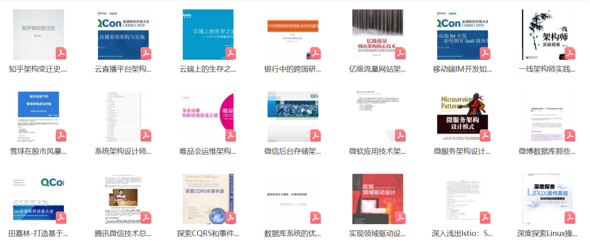

大家好， 作为一名互联网/IT从业人员，经常需要搜索一些书籍、资源，在这个过程中踩过很多坑、浪费过很多时间。

以下是我从业十多年，平常整理搜集的书籍资源，希望能够帮到大家：

总共包括500多本各类学习书籍，涵盖有Java、Python、C/C++、人工智能、架构设计、网络安全、大数据开发等书籍；可免费下载领取。

需要的小伙可添加微信公众号，进入共享群，即可免费领取👇👇👇 

# 以下是部分目录展示

## 操作系统相关

## 数据结构与算法

## Java

## Python

## 人工智能

## 架构设计

## 网络安全

## 大数据开发

## 前端相关

## 其他语言

还有更多书籍资料就不一一展示了.
